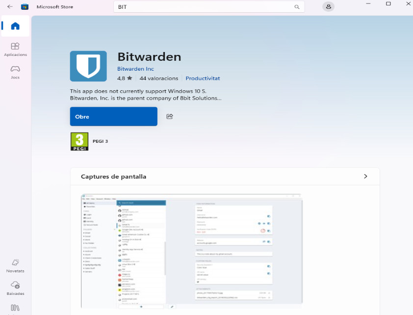
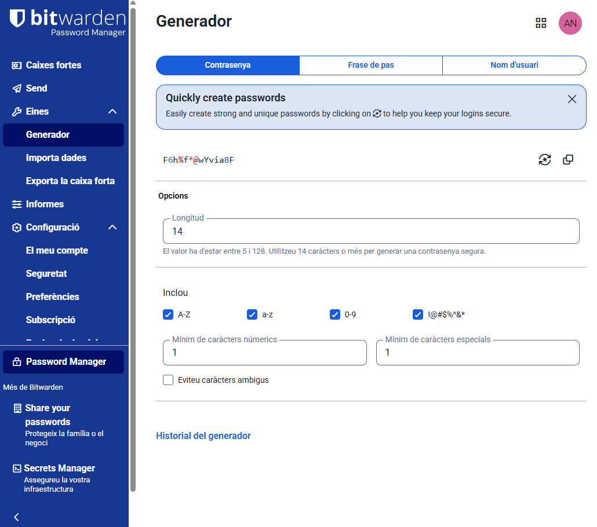

# Guia

Utilitzant l'eina que heu seleccionat a la Fase 1 (Bitwarden, KeePassX, o similar), heu de crear una Guia d'Ús per a l'Equip Tècnic. Aquesta guia ha de ser clara i basada en captures de pantalla i instruccions pas a pas.

La guia ha de cobrir els següents punts obligatoris:

## 1. Instal·lació i Configuració Inicial: Descàrrega, instal·lació i creació de la BBDD principal o compte mestre.

Comencem instal·lant la nostra eina, Bitwarden en aquest cas.

L'obrim.    

Una vegada a dins crearem el nostre nou compte.

Primerament posem el nostre nom i correu.

Fem la comprovació per poder continuar amb la creació del nou compte.

Posem una contrasenya difícil, com podria ser aquesta:

Tenim l'opció de posar l'extensió, que sempre va bé per poder emplenar automàticament les contrasenyes de manera segura amb un sol clic (no ho he pogut fer en aquest cas, per l'accés restringit, aleshores passem aquesta part).

Ara ja tindríem el nostre compte nou creat i estaríem dins.

## 2. Generació de Contrasenyes Segures: Explicació de com utilitzar el generador de contrasenyes de l'eina (paràmetres, longitud, caràcters especials).
## Generador de contrasenyes segures (Bitwarden)
1. Obrim l’eina, generador contrasenyes.
2. Triem la longitud en aquest cas 14 caràcters que són els recomanats.
3. Activem: majúscules, minúscules, números i símbols. Ja què així podrem posar de tot i aixis sera més segura.
4. Com volem que sigui segura posem mínim 1 caràcter numèric i mínim un caràcter especial.
5. Desem.

## 3. Exemples d'Ús i Emplenament Automàtic:
- Com desar una credencial d'un compte de correu electrònic.
- Com desar una credencial d'una aplicació o servei web.
- Com fer servir l’extensió del navegador per emplenar automàticament les dades.                                    
Anem a caixes fortes, a + Nou, després Inici de sessió:

Dins, a credencials d’inici de sessió posem el nostre correu i contrasenya:
                                   
Més abaix, opcions d’emplenament automàtic posem el lloc web per desar una credencial d'un servei web:

## Com fer servir l’extensió del navegador per emplenar automàticament les dades. Tenim l’accés restringit, aleshores per el que he investigat el que es faria seria:
- Instal·lem l’extensió al navegador.
- Iniciem la sessió amb la contrasenya mestra.
- Desem les credencials quan accedim a una web.
- Tornem a la web: Bitwarden les emplena automàticament.

## 4. Gestió de Còpies de Seguretat (Backup):
- Explicació detallada de com fer una còpia de seguretat de l'arxiu de contrasenyes (KDBX en KeePass o Exportació en Bitwarden).
- Recomanació de la millor pràctica per emmagatzemar aquesta còpia de seguretat de forma segura (clau USB xifrada o emmagatzematge xifrat al núvol).                                                                  
Anem a eines i exporta la caixa forta.

Li donem a confirmar el format, posem la contrasenya mestra i exportem la caixa forta.
                                                       
I ja la tindríem baixada i l’emmagatzem.                                              

[Anar a l'enunciat](../Tasca01/README.md)  
[Anar a la pàgina inicial](../README.md)
