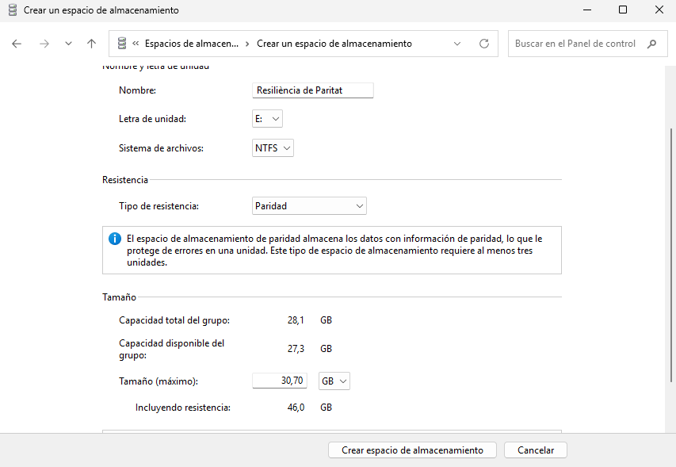
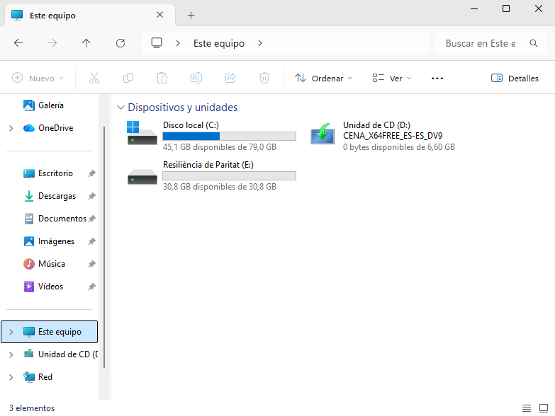

# GUIA-ESPAIS D’EMMAGATZEMATGE (STORAGE SPACES) 

| 2. Part Windows: Espais d'Emmagatzematge (Storage Spaces) |
|----------------------------------------|

## Requisits de la Implementació i Demostració:

- **Configuració inicial: Creació d'un Storage Pool: Crear un pool d'emmagatzematge inicialment amb tres discos de 10 GB (simulats).**

Amb la màquina apagada, anem a paràmetres, emmagatzematge i creem 3 discos de GB (simulats) i guardem.

Ara dins de la màquina anem administració d’equips, inicialitzem els discos, utilitzem l’estil de partició MBR.

- **Estudi de Configuracions: Demostrar i documentar la creació d'un Espai d'Emmagatzematge utilitzant:**
- **Resiliència de Mirall (Mirroring): Usar dos dels discos. Comprovar que ofereix alta disponibilitat.**     
Anem a espais d'emmagatzematge i creem.

Seguidament creem grup, usant 2 dels discos.

Posem tipus de resistència en reflexe doble i de capacitat màxima 30,70 GB.

I ja estaria.

- **Resiliència de Paritat (Parity): Explicant la seva eficiència d'espai en comparació amb el mirall. Cal usar els tres discos.**

Creem grup, usant 2 dels discos.

Posem tipus de resistència en paritat i de capacitat màxima 30,70 GB.

I ja estaria.

**Eficiència d'espai: Paritat vs Mirall**
- **Mirall (2 discos):** Guarda una còpia exacta de les dades en cada disc. Si tens 2 discos de 10 GB, només pots usar 10 GB per dades. L'altre 10 GB és per la còpia.  50% d'eficiència d'espai.
- **Paritat (3 discos):** Distribueix les dades i la informació de recuperació entre els discos. Amb 3 discos de 10 GB, pots usar 20 GB per dades i 10 GB per paritat.  ≈66% d'eficiència d'espai.

**Conclusió:** La paritat és més eficient en espai que el mirall, però pot ser una mica més lenta en rendiment.

- **Resiliència de mirall triple. Afegir tant discos de 10 GB com siguin necessaris.**

- **Demostració de la Gestió: Mostrar com es visualitza l'estat dels discos i del pool des de la consola de gestió de Windows, simulant la facilitat de manteniment.**

[Anar a l'enunciat](../Tasca03/README.md)  
[Anar a la pàgina inicial](../README.md)
