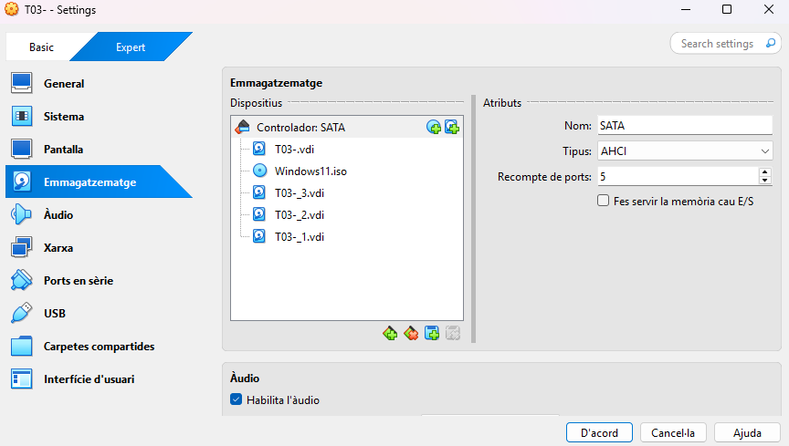
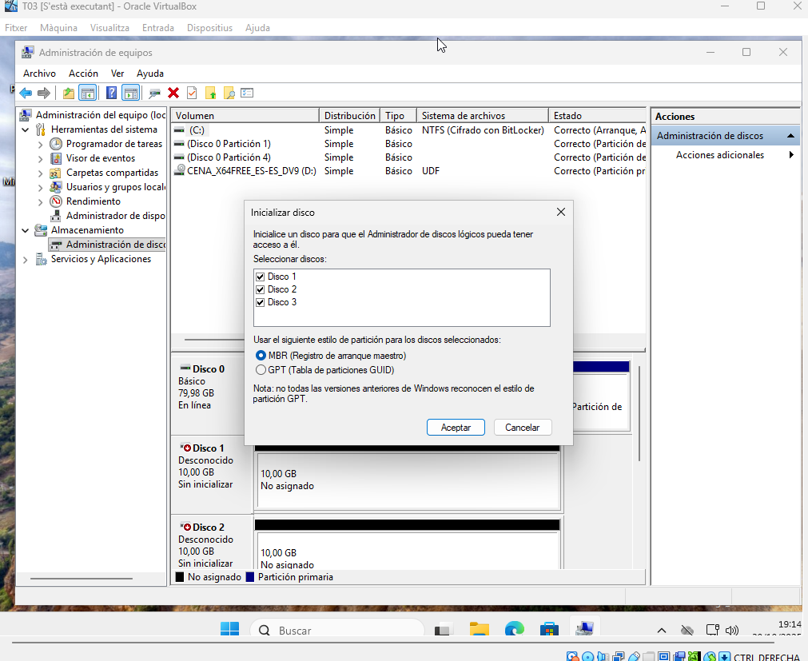
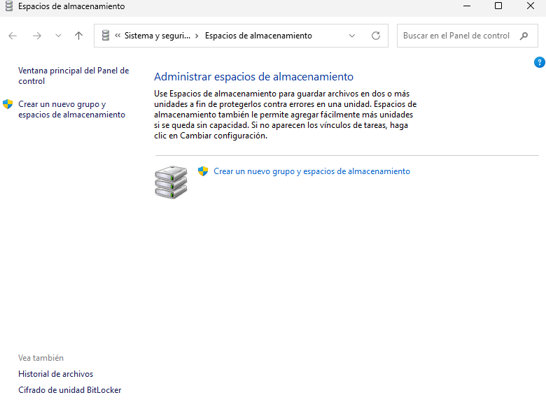
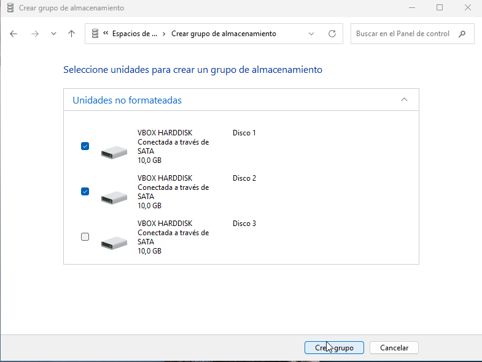
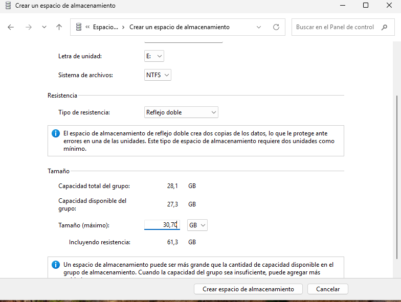
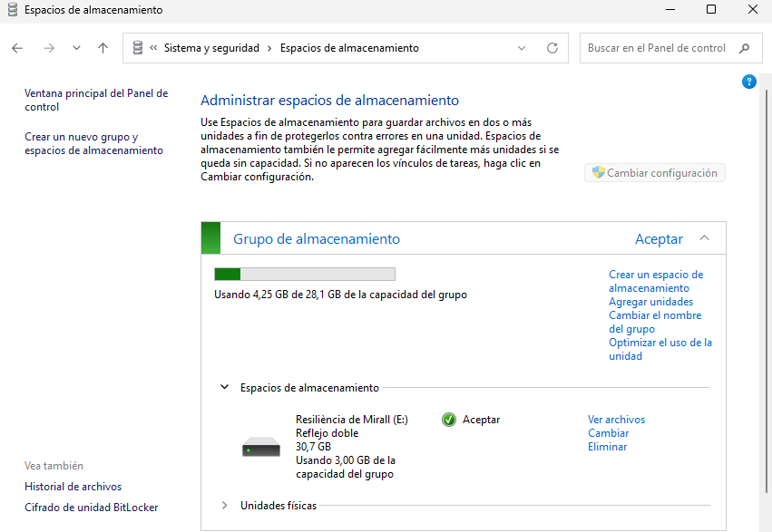

# GUIA-ESPAIS D’EMMAGATZEMATGE (STORAGE SPACES) 

| 2. Part Windows: Espais d'Emmagatzematge (Storage Spaces) |
|----------------------------------------|

## Requisits de la Implementació i Demostració:

- **Configuració inicial: Creació d'un Storage Pool: Crear un pool d'emmagatzematge inicialment amb tres discos de 10 GB (simulats).**

Amb la màquina apagada, anem a paràmetres, emmagatzematge i creem 3 discos de GB (simulats) i guardem.

Ara dins de la màquina anem administració d’equips, inicialitzem els discos, utilitzem l’estil de partició MBR.

- **Estudi de Configuracions: Demostrar i documentar la creació d'un Espai d'Emmagatzematge utilitzant:**
- **Resiliència de Mirall (Mirroring): Usar dos dels discos. Comprovar que ofereix alta disponibilitat.**
Anem a espais d'emmagatzematge i creem.

Seguidament creem grup, usant 2 dels discos.

Posem tipus de resistència en reflexe doble i de capacitat màxima 30,70 GB.

I ja estaria.

[Anar a l'enunciat](../Tasca03/README.md)  
[Anar a la pàgina inicial](../README.md)
