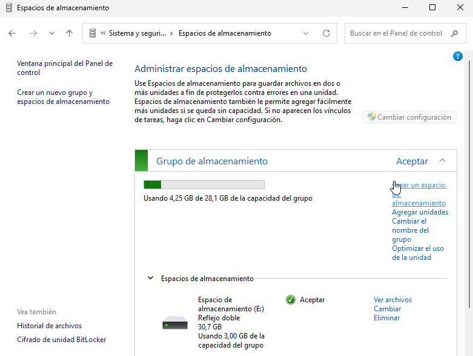

# GUIA-ESPAIS D’EMMAGATZEMATGE (STORAGE SPACES) 

| 2. Part Windows: Espais d'Emmagatzematge (Storage Spaces) |
|----------------------------------------|

## Requisits de la Implementació i Demostració:

- **Configuració inicial: Creació d'un Storage Pool: Crear un pool d'emmagatzematge inicialment amb tres discos de 10 GB (simulats).**

Amb la màquina apagada, anem a paràmetres, emmagatzematge i creem 3 discos de GB (simulats) i guardem.

Ara dins de la màquina anem administració d’equips, inicialitzem els discos, utilitzem l’estil de partició MBR.

- **Estudi de Configuracions: Demostrar i documentar la creació d'un Espai d'Emmagatzematge utilitzant:**
- **Resiliència de Mirall (Mirroring): Usar dos dels discos. Comprovar que ofereix alta disponibilitat.**
 
Anem a espais d'emmagatzematge i creem.

Seguidament creem grup, usant 2 dels discos.

Posem tipus de resistència en reflexe doble i de capacitat màxima 30,70 GB.

I ja estaria creat.

I posem algun arxiu dins de l’espai per fer la prova de disponibilitat.

Comprovació que ofereix alta disponibilitat. Desconnectem el disc 2.

Surt una alerta que s’ha perdut el mirall, però podem continuar llegint la informació que havíem guardat.

Afegim el tercer disc a l'espai de reflex doble i entre, no surt la alerta i podem veure el nostre disc de reflex doble amb normalitat i sense problemes. 

- **Resiliència de Paritat (Parity): Explicant la seva eficiència d'espai en comparació amb el mirall. Cal usar els tres discos.**

Creem grup, usant els 3  discos.

Posem tipus de resistència en paritat i de capacitat màxima 30,70 GB.

I ja estaria creat.

**Eficiència d'espai: Paritat vs Mirall**
- **Mirall (2 discos):** Guarda una còpia exacta de les dades en cada disc. Si tens 2 discos de 10 GB, només pots usar 10 GB per dades. L'altre 10 GB és per la còpia.  50% d'eficiència d'espai.
- **Paritat (3 discos):** Distribueix les dades i la informació de recuperació entre els discos. Amb 3 discos de 10 GB, pots usar 20 GB per dades i 10 GB per paritat.  ≈66% d'eficiència d'espai.

**Conclusió:** La paritat és més eficient en espai que el mirall, però pot ser una mica més lenta en rendiment.

- **Resiliència de mirall triple. Afegir tant discos de 10 GB com siguin necessaris.**

Creem grup, usant tant discos de 10 GB com siguin necessaris (5 discos).

- **Demostració de la Gestió: Mostrar com es visualitza l'estat dels discos i del pool des de la consola de gestió de Windows, simulant la facilitat de manteniment.**

[Anar a l'enunciat](../Tasca03/README.md)  
[Anar a la pàgina inicial](../README.md)
