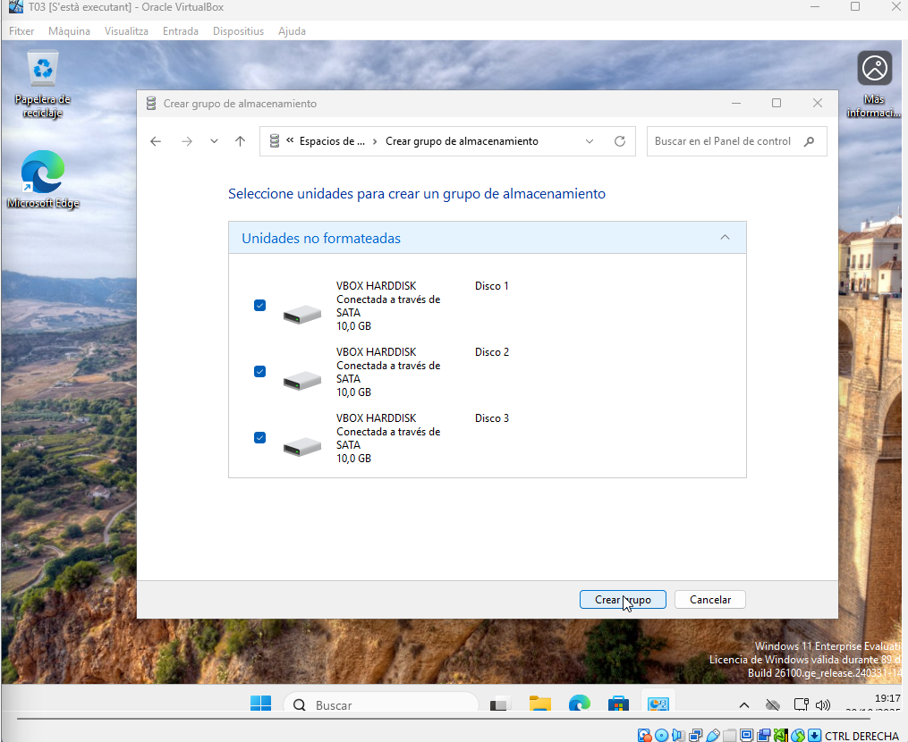

# GUIA-ESPAIS D’EMMAGATZEMATGE (STORAGE SPACES) 

| 2. Part Windows: Espais d'Emmagatzematge (Storage Spaces) |
|----------------------------------------|

## Requisits de la Implementació i Demostració:

- Configuració inicial: Creació d'un Storage Pool: Crear un pool d'emmagatzematge inicialment amb tres discos de 10 GB (simulats).

[Anar a l'enunciat](../Tasca03/README.md)  
[Anar a la pàgina inicial](../README.md)
