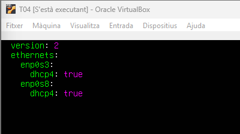
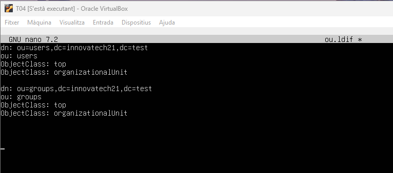
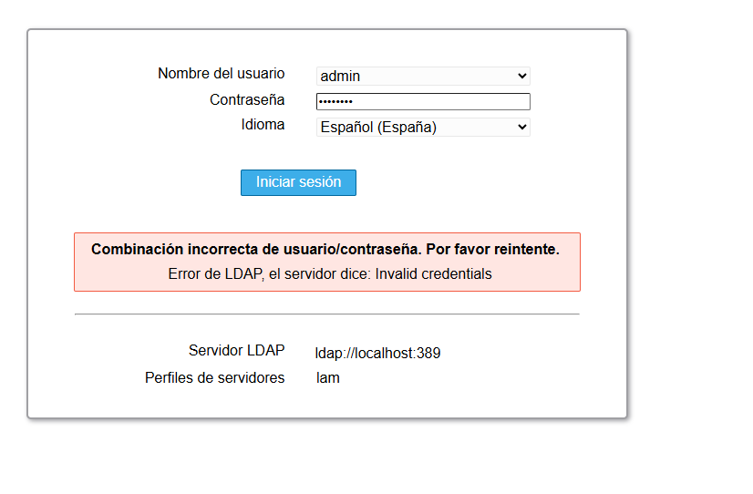
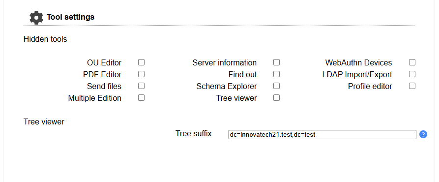

# GUIA-SERVEIS DE DIRECTORI. LDAP

| 1. Requeriments d'Infraestructura Inicial |
|----------------------------------------|

Configurem la màquina Server (Server Hostname), posem la següent comanda i després posem com a nom del host: server i com a nom del host complet: server.innovatechXX.test (XX, número de llista, 21).

Fem la comprovació amb: hostname i hostname -f.

Adaptador 1 de xarxa en NAT, el posem/deixem en NAT.

Posem l'adaptador 2 de xarxa en Adaptador de només amfitrió, per a la comunicació privada amb el Client virtual  i la màquina física.

Posem la següent comanda per habilitar el segon adaptador, apliquem els canvis i guardem els canvis.

Verifiquem, escrivim: ip a, per veure les IP’s.

| 2. Tasques d'Implementació i Configuració del Servidor LDAP |
|----------------------------------------|

| 2.1. Instal·lació i Configuració Base d'OpenLDAP |
|----------------------------------------|

Instal·lem el servei OpenLDAP amb la següent comanda:

Contrasenya: usuari. Continuem.

Fem la comprovació, amb status.

Posem la següent comanda per veure les dades del directori LDAP.

Configuració de la base de dades, reconfigurem el paquet.

Ens diu que no es crearà la configuració ni la base de dades inicial si habilitem aquesta opció, li diem que no volem ometre la configuració del servidor OpenLDAP.

Posem de nom de domini DNS: innovatech21.test 

Nom de la organització: innovatech21.test

Contrasenya de l’administrador, p@ssw0rd

Indiquem que quan s’elimini el paquet, s’esborri la BD creada.

Movem la informació del directori que hi ha a una carpeta de backup.

Fem la comprovació de que s’ha modificat la informació del directori.

Posem la següent comanda i creem dues OUs: users i groups mitjançant un fitxer .ldif.

Seguidament posem la següent comanda, per agregar l'arxiu al directori.

Fem una consulta amb la comanda ldapsearch mostrant totes les OUs creades al directori.

| 3.2. Gestió i Administració (LAM) |
|----------------------------------------|

Instal·lem el Gestor d'Usuaris LDAP (LAM) amb la següent comanda, això ja descarregarà totes les dependències necessàries.

Posem ip a, per veure l'ip i després la posem al buscador agregant al final /lam i entrarem a la web.

Dins, cliquem en LAM configuration.

Després Edit server profiles.

Posem la contrasenya; lam i entrem.

Manage server profiles: amb aquest pots administrar els diferents perfils, contrasenya..

Ara anem a opcions generals i configurem, compte, admin, idioma..

Anem a Account Types definim els DN dels usuaris i grups, també incloem una OU pels usuaris i una altre pels grups i es pot afegir els tipus d'objectes del directori, són usuaris i grups per defecte.

Accedim al directori.

Ara creem els dos grups de seguretat al directori: tech i manager. Anem a comptes, grups i nou grup.

Primer grup.

Segon grup.

Ara creem un usuari per a cada grup: tech01 (membre de tech) i manager01 (membre de manager). Per els usuaris, anem a comptes, usuaris i nou usuari.

Primer usuari. Posem en personal el nom i cognom.

Després a Unix posem el nom de l'usuari i nom comú.

Ja està, s’ha creat un nou grup.

Segon usuari. Posem en personal el nom i cognom.

Després a Unix posem el nom de l'usuari i nom comú.

Ja està, s’ha creat un nou grup.

Ja estarien creats els grups.

I ja estarien creats els usuaris.

Posem contrasenya als 2 usuaris.

| 4. Integració de Client (Client Ubuntu Desktop) |
|----------------------------------------|

Instal·lem el client i configurem la interfície de xarxa, deixem l’adaptador 1 en NAT i posem el segon en adaptador de només l’amfitrió, seguidament després comprovem amb ip a, tot això per comunicar-se amb el servidor.

Fem clic a la barra, en surten diverses opcions, escollim Instantànies, després, cliquem on posa + fes, guardem els canvis i iniciem la màquina.

Primer fem actualitzacions.

Després ip a, per veure la ip i posar-la.

Configurem l'arxiu d'hosts del client per resoldre l'adreça IP del servidor a server.innovatechXX.test. Primer posem la següent comanda per entrar a l’arxiu /etc/hosts

Canviem la segona i tercera línea, amb l’ip, innovatech.test

Després anem a l’arxiu /etc/hostname

On posem client.innovatech21.test

Fem la comprovació.

Ara primerament comencem instal·lant els mòduls necessaris per permetre l'autenticació amb LDAP. Instal·lem els mòduls necessaris per usar libmap i nss.

Posem l’identificador uniforme de recursos del servidor LDAP.

Posem el nom distingit de la base de cerca.

Posem la versió LDAP a utilitzar, 3.

Fes que l'usuari root local sigui administrador de la base de dades, posem que si.

Ens diu que, si la base de dades LDAP requereix login, posem que no.

Posem el compte LDAP per a l'usuari root.

Posem la contrasenya del compte root LDAP.

Ara comprovem la connectivitat amb el servidor fent una consulta ldapsearch des del client.

Modifiquem els arxius de configuració del client necessaris. Primerament configurem l'arxiu nsswitch.conf, indicant que s'usarà ldap per usuaris i grups.

Canvis:

Ara anem a l'arxiu /etc/pam.d/common-password, anem a aquesta línea que surt (sortia): use_authtok i eliminem: use_authtok

Ara anem a l’arxiu /etc/pam.d/common-session, on afegim la següent línia per crear els perfils.

Canvi:

Reiniciem els serveis i verifiquem amb la següent comanda: getent passwd que els usuaris del directori són visibles localment.

Reiniciem el servei.

Comprovem que veu els usuaris LDAP.

Editem aquest arxiu amb la següent comanda:

Per permetre l’inici de sessió gràfica, afegint la següent línea.

Reiniciem el client i provem a iniciar sessió amb un dels usuaris del directori.

Anem a afegir un usuari, en aquest cas mostraré el tech01

Posem el nom ttech01

I la contrasenya.

I ens entra.

Usuaris del directori.

Després d’iniciar sessió, comprovem que se li ha creat la carpeta personal i comprovem l’usuari.

[Anar a l'enunciat](../Tasca04/README.md)  
[Anar a la pàgina inicial](../README.md)
