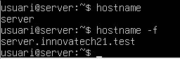
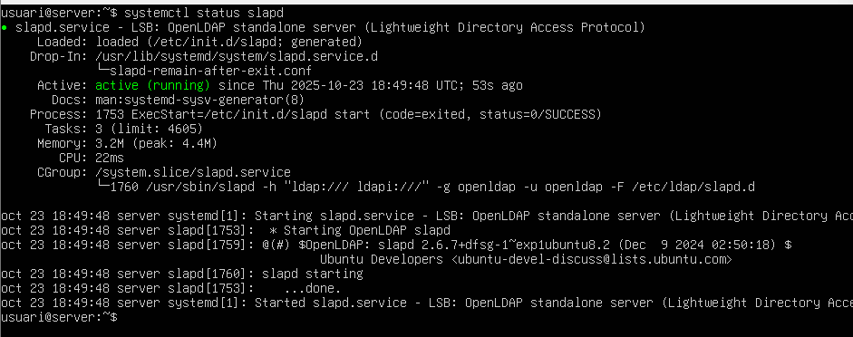
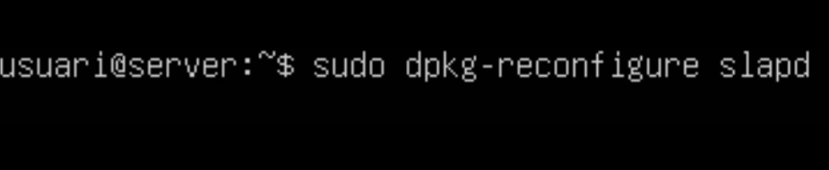
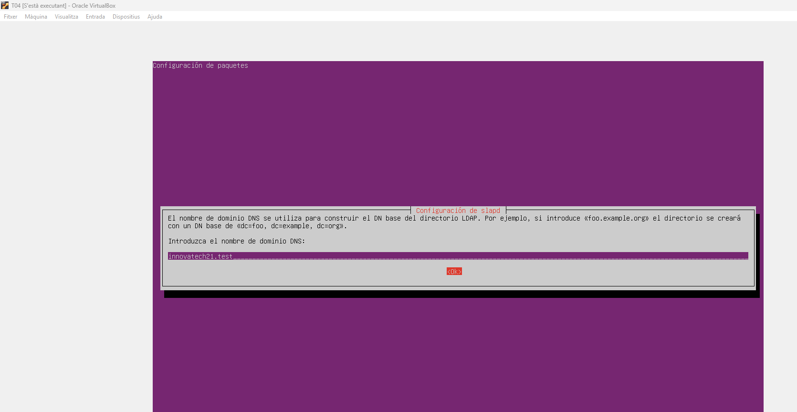

# GUIA-SERVEIS DE DIRECTORI. LDAP

| 1. Requeriments d'Infraestructura Inicial |
|----------------------------------------|

- Configurem la màquina Server (Server Hostname), posem la següent comanda i després posem com a nom del host: server i com a nom del host complet: server.innovatechXX.test (XX, número de llista, 21).

- Fem la comprovació amb: hostname i hostname -f.

- Adaptador 1 de xarxa en NAT, el posem/deixem en NAT.

- Posem l'adaptador 2 de xarxa en Adaptador de només amfitrió, per a la comunicació privada amb el Client virtual  i la màquina física.

- Escrivim: ip a, per veure les IP’s.

| 2. Tasques d'Implementació i Configuració del Servidor LDAP |
|----------------------------------------|

| 2.1. Instal·lació i Configuració Base d'OpenLDAP |
|----------------------------------------|

- Instal·lem el servei OpenLDAP amb la següent comanda:

- Contrasenya: usuari. Continuem.

- Fem la comprovació, amb status.

- Posem la següent comanda per veure les dades del directori LDAP.

- Configuració de la base de dades, reconfigurem el paquet.

- Ens diu que no es crearà la configuració ni la base de dades inicial si habilitem aquesta opció, li diem que no volem ometre la configuració del servidor OpenLDAP.

- Deixem el nom de domini DNS com a predeterminat.

[Anar a l'enunciat](../Tasca04/README.md)  
[Anar a la pàgina inicial](../README.md)
