# FONAMENTS DEL SERVEI DNS

Posem el 2 adaptador en adaptador pont, després dins de la màquina, anem a configuració, xarxa, Ethernet (enp0s8), afegim, posem la direcció, màscara de xarxa i guardem.

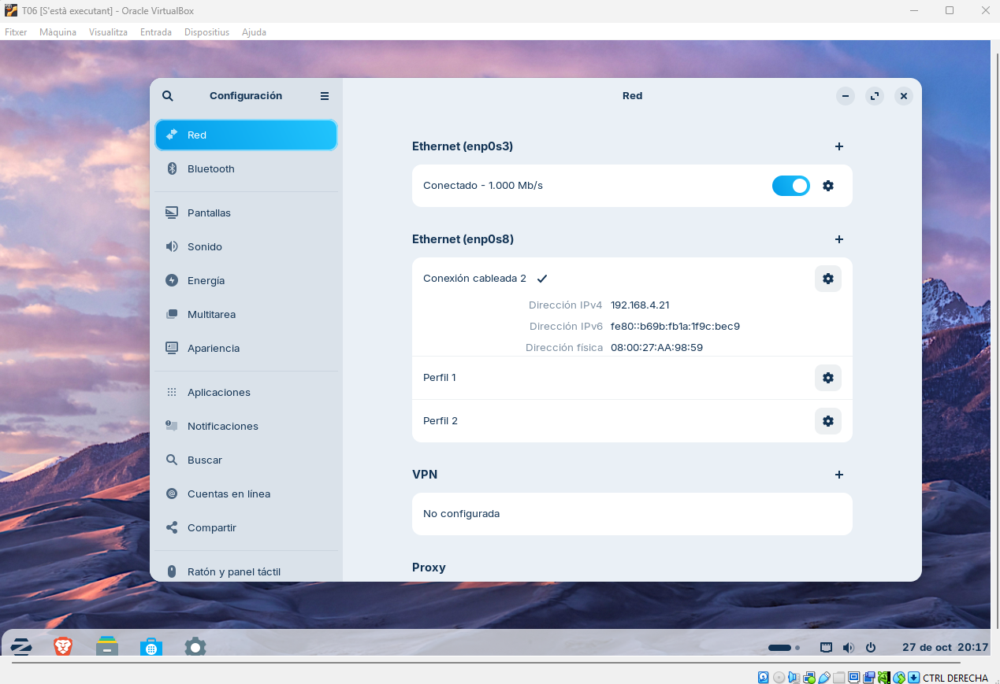

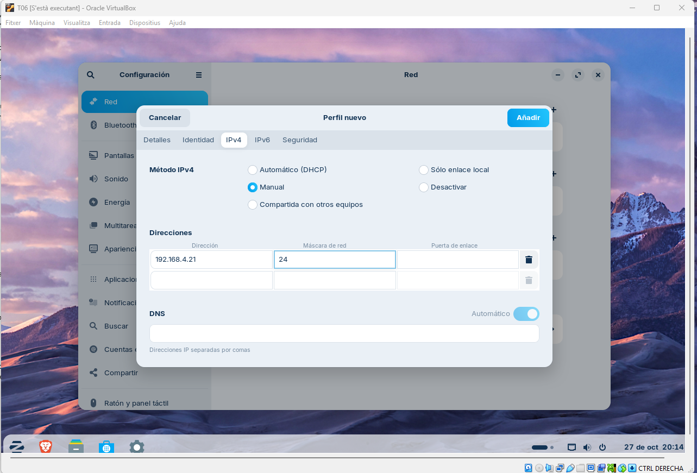

| A. Diagnosi Avançada amb dig (Linux / macOS) |
|----------------------------------------|
## Comanda 1: Consulta Bàsica de Registre A
**Executa dig xtec.cat A**
**Anàlisi: Identifica la IP de resposta, el valor TTL i el servidor que ha respost a la consulta.**
- **IP de resposta:** 83.247.151.214  
- **Valor TTL:** 243 segons  
- **Servidor que ha respost:** 127.0.0.53 (resolent a través de UDP)

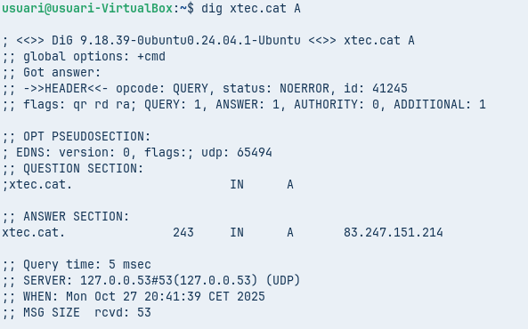

## Comanda 2: Consulta de Servidors de Noms (NS)
**Executa dig tecnocampus.cat NS**
**Anàlisi: Quins són els servidors de noms autoritatius per a aquest domini?**
Els servidors de noms autoritatius per al domini tecnocampus.cat són:
- ns-1071.awsdns-05.org
- ns-130.awsdns-16.com
- ns-1689.awsdns-19.co.uk
- ns-535.awsdns-02.net

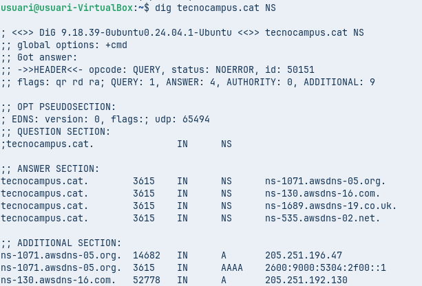

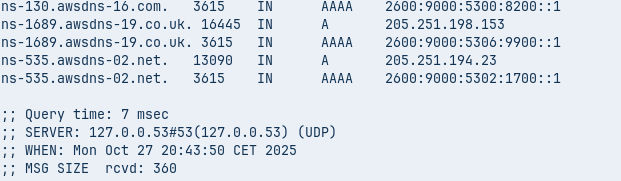

## Comanda 3: Consulta Detallada SOA
**Executa dig escolapia.cat SOA**
**Anàlisi: Quina és la informació del correu de l'administrador i el número de sèrie del domini?**
El correu de l’administrador mostra qui és el responsable tècnic del domini.     
**Correu de l’administrador:** root@dns1.nominalia.com    
           **Número de sèrie:** 1761028965

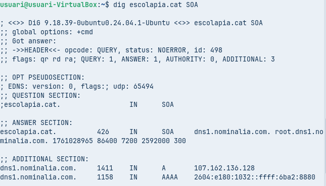

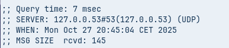

## Comanda 4: Consulta resolució inversa
**Executa comanda dig -x 147.83.2.135**
**Anàlisi: Quina informació sobre els registres s’obté?**
S’obtenen diversos registres PTR associats a la IP 147.83.2.135.
Que aquests apunten a dominis de la UPC (Universitat Politècnica de Catalunya).
Registres obtinguts:       
- **barcelonatech-upc.eu**           
- **www.upc.es**     
- **saladepremsa.upc.edu**     
- **edicioweb.produccio.upc.edu**    
- **masters.upc.edu**   
- **upc.cat**   
- **barcelonatech.upc.edu**   
- **upc.edu**

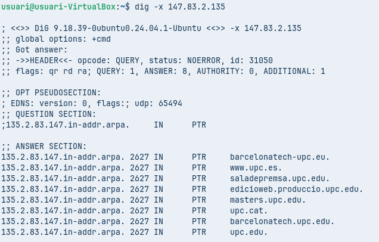

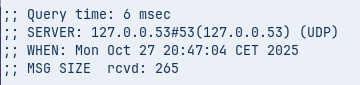

| Comprovació de Resolució amb nslookup (Multiplataforma) |
|----------------------------------------|
## Comanda 1: Consulta Bàsica no Autoritativa
**Seleccionar type=A i com a domini de consulta tecnocampus.cat**
**Anàlisi: Per què indica que la resposta és no autoritativa?**
La resposta no és autoritativa perquè el servidor consultat no administra la zona tecnocampus.cat i està retornant dades que té guardades en memòria cau, no dades originals de la font autoritativa.

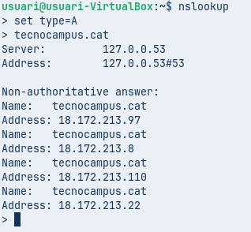

## Comanda 2: Consultes autoritatives
**Escriure server IP i escriure la IP del primer servidor de noms del domini tecnocampus.cat que s’ha obtingut d’una consulta anterior. A continuació, indiqueu que voleu consultar registres de tipus A i del domini tecnocampus.cat**
**Anàlisi: Quines diferències s’observen a la resposta obtinguda amb la comanda 1?**
Doncs que la primera com he comentat no és autoritativa i la segona si.

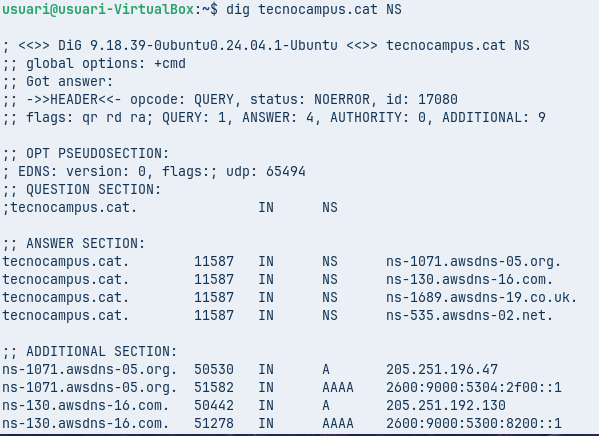
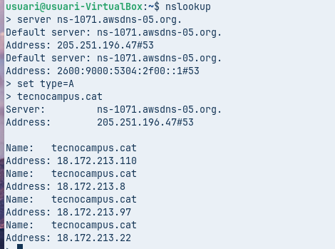

| Resolucions locals |
|----------------------------------------|
## Finalment es vol comprovar el funcionament de la resolució local, útil per entorns de xarxa local on no es disposa de servidor de noms propi i que evita haver d’accedir a equips o recursos per la seva IP.    
Al fer un ping amb la ip de la enp0s8 ens dóna error, aleshores ho afegim a hosts la ip i li posem un nom i així és pot fer ping a aquella ip només amb el seu nom, així no tenim que memorizar que es 192.168.1.163 i només momeritzem que es diu servidor-de-prova.

[Anar a l'enunciat](../Tasca06/README.md)  
[Anar a la pàgina inicial](../README.md)
